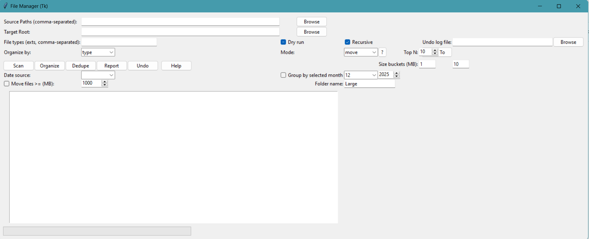

# File-Manager

A small CLI + optional GUI toolset for scanning, organizing, deduplicating, and reporting on local files. Focus is on safe operations (dry-run by default), clear previews, and undo logs.

Core components
- `cli.py` — command-line entrypoint (scan, organize, dedupe, report, undo)
- `file_manager/` — package with `scanner`, `organizer`, `deduper`, `reporter`, `utils`
- `gui_tk.py` — Tkinter GUI frontend (stable fallback)

Installation

1. Create and activate a virtual environment (recommended):

```bash
python -m venv .venv
source .venv/bin/activate   # Windows: .venv\Scripts\Activate.ps1
```

2. Install dependencies (if any):

```bash
pip install -r requirements.txt
```

Quick usage — CLI

- Scan a folder and save JSON:

```bash
python cli.py scan C:\path\to\folder --out scan.json
```

- Organize by type (dry run — safe preview):

```bash
python cli.py organize C:\path\to\folder --target C:\path\to\out --by type --dry-run
```

- Apply organization (non-dry):

```bash
python cli.py organize C:\path\to\folder --target C:\path\to\out --by date --no-dry-run --mode copy
```

- Undo an organize log (log produced under target root named `fm_organize_*.json`):

```bash
python cli.py undo C:\path\to\out\fm_organize_YYYYMMDDT...json
```

GUI (Tkinter)

- Launch the GUI frontend:

```bash
python gui_tk.py
```

- Notes about the GUI:
	- Enter one or more source paths (comma-separated) and set a Target Root.
	- Use the `Mode` selector to choose how files are handled: `move`, `copy`, `hardlink`, or `index`.
	- The preview modal shows an estimated disk usage and the top-N largest files. Preview is required before applying.
	- Keep `Dry run` enabled while experimenting.

Screenshot

Below is a screenshot of the GUI preview. 




Mode semantics and safety

- `move`: physically move files into the target folders. Undo will attempt to move them back (collision-safe restored names are created when necessary).
- `copy`: copy files into the target folders, leaving originals in place. Undo will remove the created copies.
- `hardlink`: create filesystem hardlinks to originals (same-volume only). If hardlink creation is not possible, a copy fallback is used. Undo will remove the hardlink.
- `index`: generate index/manifest files referencing originals (does not move files). Undo will remove the generated index files.

Always preview and keep `Dry run` enabled when trying new operations. The GUI provides a preview modal with a checkbox confirmation to prevent accidental applies.

Undo logs

- Non-dry runs write an undo log `fm_organize_YYYYMMDDT*.json` into the chosen target root. This JSON contains one entry per action with fields like `src`, `dst`, `time`, `status`, and `mode`.
- Use `cli.py undo <logpath>` or the GUI Undo flow to revert actions. `undo` respects `mode` recorded in the log.

Testing and validation

- A small validation script is included at `tests/validate_app.py`. Run it to exercise `copy` and `move` workflows and verify undo behavior:

```bash
python tests/validate_app.py
```

Contributing and next steps

- Planned improvements:
	- Implement `safe_hardlink` and full `hardlink` end-to-end mode.
	- Implement `index` mode generators (HTML/JSON manifests).
	- Add unit tests (pytest) and CI integration.

- If you add new modes or change behavior, update the undo handling in `file_manager/organizer.py` so logs remain reversible.

License

This project is provided as-is. Add licensing information as appropriate for your use.

Requirements

- Runtime: `Pillow` is required for EXIF/date-based organization. Install with:

```bash
pip install -r requirements.txt
```

- Development / optional tools: `PyInstaller` is used to create the standalone executable (see Build section). `pytest` is recommended for adding tests.

Building the executable

You can produce a single-file Windows executable using PyInstaller (this repository includes a built example under `dist/` when available):

```bash
python -m pip install --user pyinstaller
python -m PyInstaller --onefile --windowed --name FileManagerApp gui_tk.py
# result: dist/FileManagerApp.exe
```

Notes:
- Use `--windowed` to hide the console; omit it if you want a console for logs.
- To include icons or extra data, update the generated `.spec` file and re-run PyInstaller.

Troubleshooting

- If the GUI shows unexpected behavior after you edited code, restart the GUI/python process (stale imports can persist in long-lived interpreters). The GUI also reloads the authoritative organizer implementation before running organize-by-type.
- Missing EXIF behavior: ensure `Pillow` is installed.
- If the PyInstaller-built EXE fails to find resources, add them to the `.spec` or pass `--add-data` during the build.

Undo log example

After a non-dry run the organizer writes a JSON undo log into the target root named like `fm_organize_YYYYMMDDT...json`. Example usage:

```bash
# revert actions recorded in the log
python cli.py undo C:\path\to\target\fm_organize_20251225T181200Z.json
```

Contributing, CI & Tests

- Run the small validation script:

```bash
python tests/validate_app.py
```

- Recommended additions: a `pytest` suite and a CI workflow that runs linting and tests on PRs.
